

<h2>Reporting of Module II "YC Introduction"</h2> 

<h3><u>Creating VMs</u></h3>
    
Creating CentOS VM

    
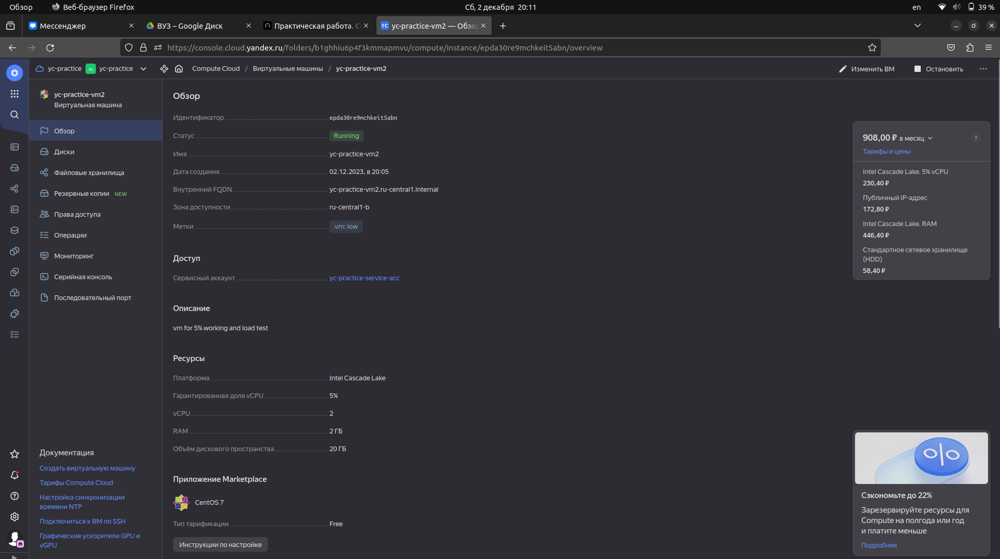
 

Monitoring page

    
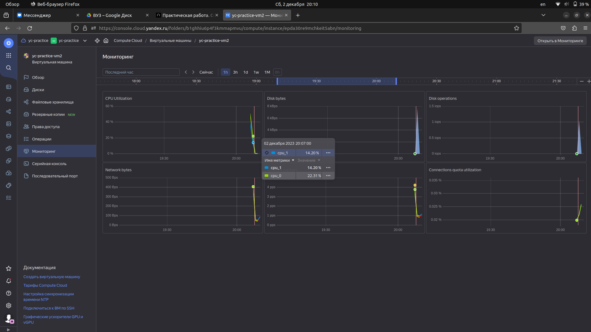
 

Result creating two VMs page</b>
    
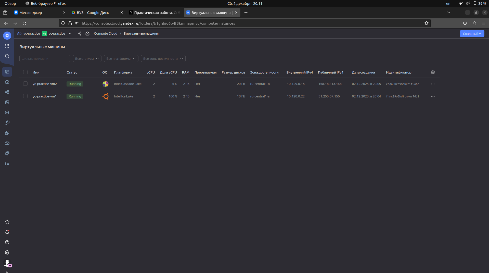
    
 

Creating compute instances is a simplest task to do in YC.

<h3><u>Metadata</u></h3>

Adding metadata to instance via YC CLI.

    
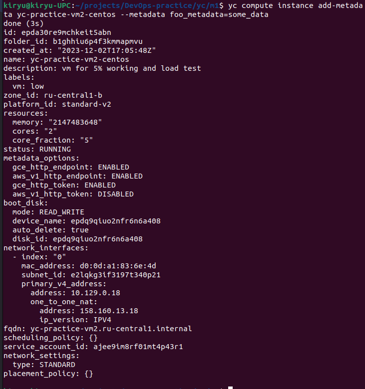
 

Getting metadata from inside of VM.

    
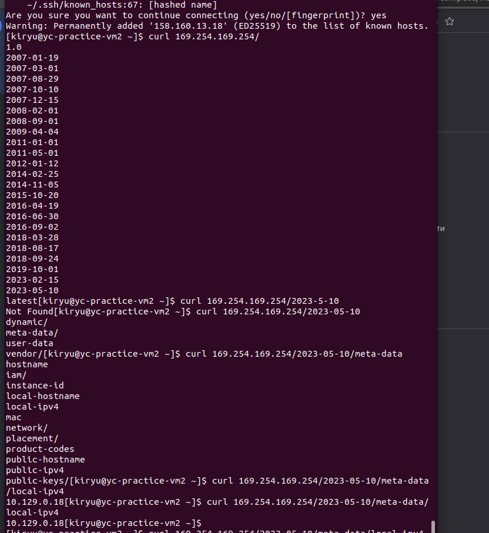
 

Removing metadata.</b>
    
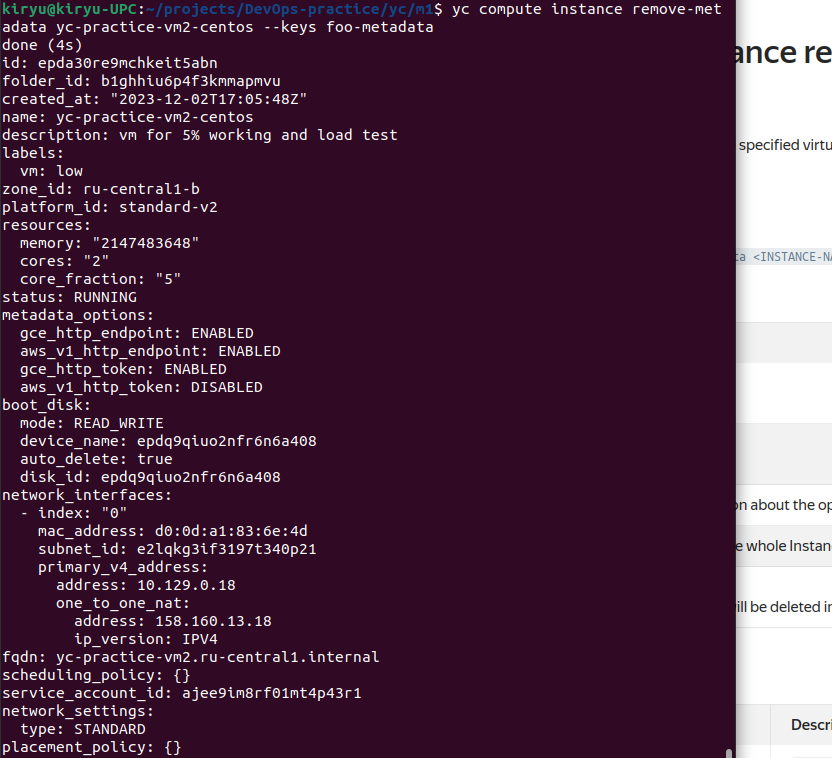
 

Metadata in YC Web.</b>
    
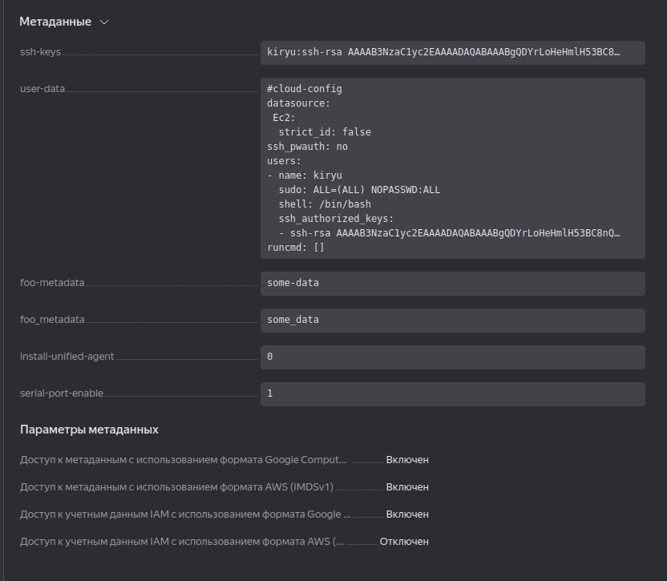
 

Result in removing metadata i YC Web.</b>
    
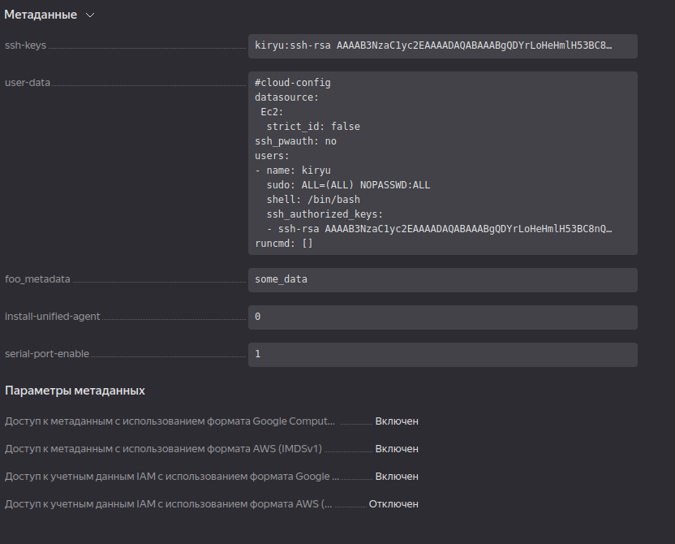
 

<h3><u>Serial console and port</u></h3>

Serial console in YC Web.

    
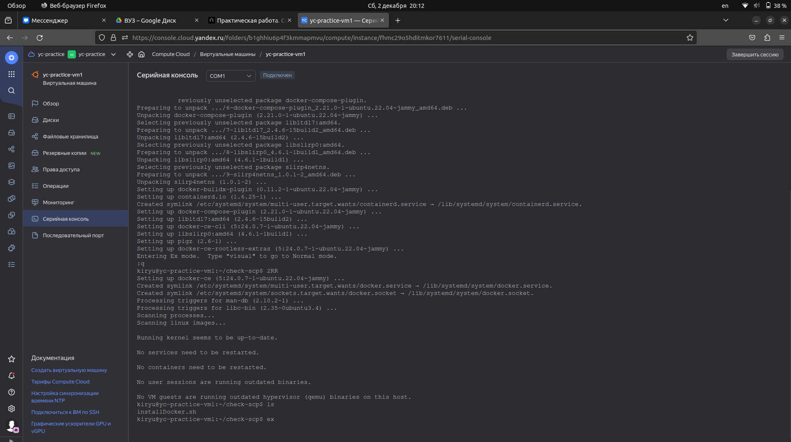
 

Serial console in ssh.

    
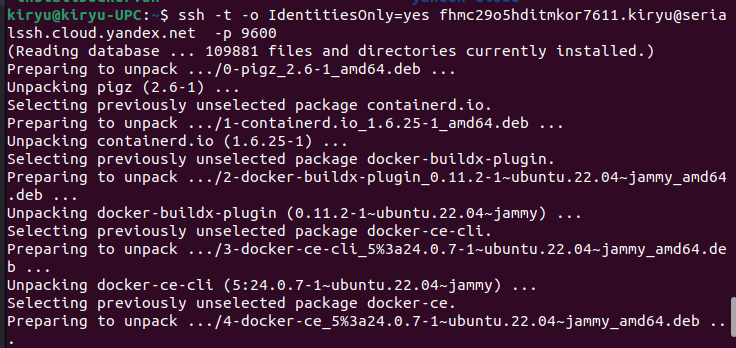
 

SSH connection and scp result.

    
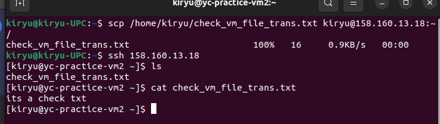
 

<h2>Summarization</h2>

This module is a introduction to YC, so it's so simple to create VM and to switch between pages and services. Adding metadata allows to bring some additional information to vm and other object stroing in cloud. Also serial console has some extra connection for VM.
